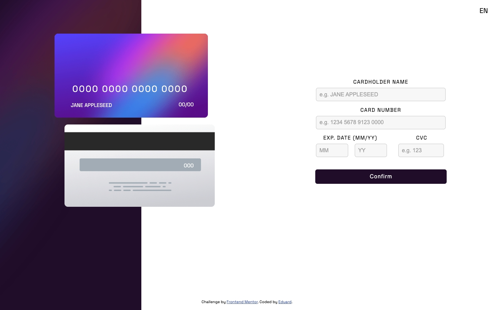
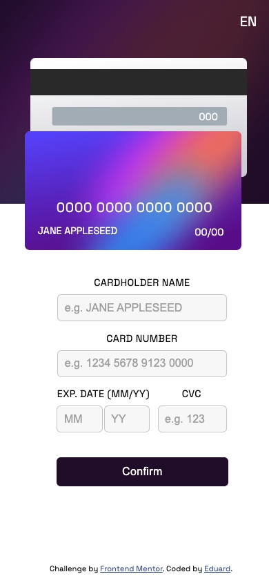

# **Interactive Card Details Form**

## **Description**

Interactive form for entering bank card data

## **Features**

1. 🔄 Real-time update map when entering data
2. ✅ Field validation:
 - Name user (only english letters)
 - Card number (16 digits with automatic spaces)
 - Validity (date correctness)
 - CVC code (3 digits)
3. 🌍 Multilingual (EN/RU with switch)
4. 📱 Fully responsive (from 320px to 4K)
5. 🎨 Stylish design

## ⚙️ **Installation and configuration**

### 1. Clone repositories

`git clone https://github.com/selikon13/interactive-card`
`cd interactive-card`

### 2. **Project launch (3 ways)**: 
   #### 1. Just open HTML file
   #### 2. Via Live Server (https://github.com/ritwickdey/vscode-live-server-plus-plus )
- Install the Live Server extension for VS Code
- Right click on `index.html` ☞ "Open with Live Server"
- Will automatically open in browser at `http://localhost:5000`
   
   #### 3. Via Python server
- `python3 -m http.server 8000`

Open in your browser: `http://localhost:8000`

### **How to use**

1. Enter your card details into the form
2. Watch them appear on a virtual map
3. Click "Confirm" to check
4. If validation is successful, you will see a success message
5. Click "Continue" to refresh the page

## 🌏 **Switch language**

Press the "EN/RU" button in the upper right corner to change the interface language

## 📸**Screenshots**

### Desctop

### Mobile

## 🛠 **Technologies**

- Structure: HTML 
- Style: CSS3 with custom properties (CSS variables)
- Logics: Vanilla JavaScript
- Fonts: Space Grotesk (Google Fonts)
- Adaptive: Descktop-first + media queries

## **Contacts**

- Email: fnaffi095@gmail.com
- GitHub: selikon13 (https://github.com/selikon13)